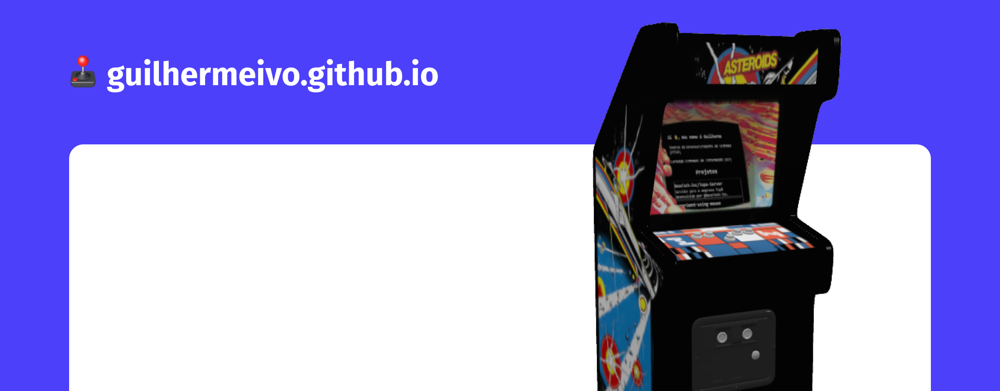

<h1 align="center">
  🕹️ guilhermeivo.github.io
</h1>

<h1 align="center">
    
</h1>

> Projeto desenvolvido usando [WebAssembly](https://developer.mozilla.org/docs/WebAssembly) (WasiSDK), [WebGL API](https://developer.mozilla.org/docs/Web/API/WebGL_API) e [Jekyll](https://jekyllrb.com)

# Organização

`_posts/`\
 └ `YEAR-MONTH-DAY-title.MARKUP`: Jekyll Posts
`assets/`\
`bin/`\
`src/`\
 ├ `WebGL/`: Recursos usados para conectar com a WebGL API.\
 └ `wasm.h`: Baseado nos recursos utilizados no [wasi-libc](https://github.com/WebAssembly/wasi-libc).\
`test/`
`index.html`

# Rodando

Rodar aplicação:

```sh
$ npm install && ./bin/install.sh
$ ./bin/build.sh && ./bin/run.sh
```

# Testes/Benchmarks

```sh
$ ./bin/test.sh -r -t<NUMBER>
```

| Realizar Benchmarks | Quantidade |
|---------------------|------------|
| -r                  | -t<NUMBER> |


## License
Este projeto está sob licença. Consulte o arquivo [`LICENSE`](./LICENSE) para obter detalhes.